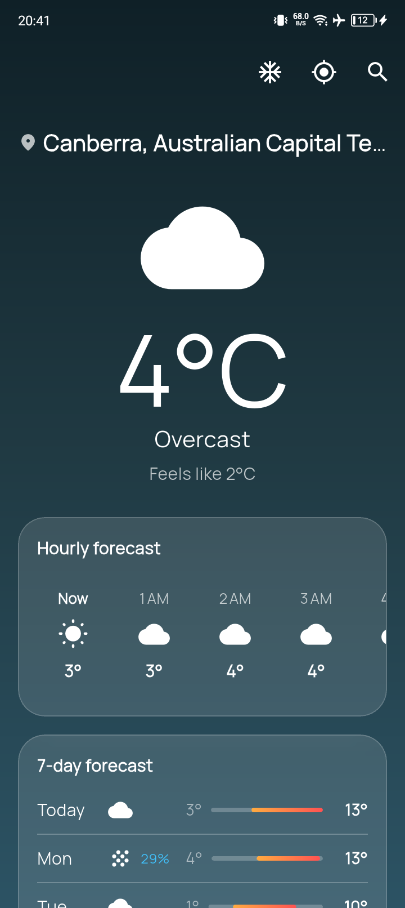
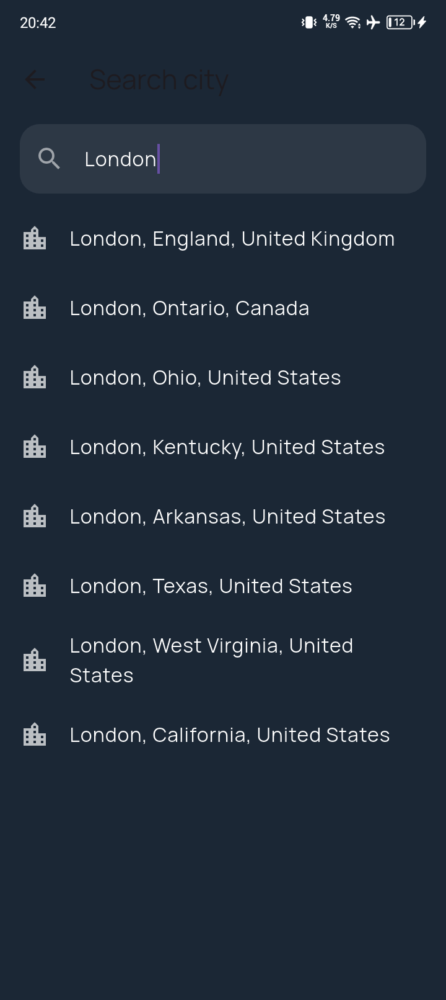

# 🌤️ Weather

A clean, modern weather app for Android and iOS, built with Flutter.

---

## ✨ Features

- 📍 **Auto-detects your location** (with permission) or search any city worldwide
- 🌡️ Current conditions, **24-hour hourly forecast**, and **7-day forecast**
- 🎨 Dynamic gradient background and icons that shift with the weather condition and time of day
- 🧊 Frosted-glass ("glassmorphism") card UI
- 🔄 Pull-to-refresh, graceful loading and error states
- 🌡️ °C / °F toggle
- 💾 Remembers your last-viewed location between launches
- 🆓 **No API key required** — powered by the free [Open-Meteo](https://open-meteo.com) API

## 📱 Screenshots

## 🚀 Download Here 
https://github.com/CpSharp404/Weatherly/releases/tag/v1.0

## Tools Used
---
| Package | Purpose |
|---|---|
| [`http`](https://pub.dev/packages/http) | Networking |
| [`geolocator`](https://pub.dev/packages/geolocator) | Device location |
| [`permission_handler`](https://pub.dev/packages/permission_handler) | Runtime permissions |
| [`shared_preferences`](https://pub.dev/packages/shared_preferences) | Local persistence |
| [`google_fonts`](https://pub.dev/packages/google_fonts) | Typography |
| [`intl`](https://pub.dev/packages/intl) | Date/time formatting |

Weather and geocoding data from [Open-Meteo](https://open-meteo.com) — free, no API key, no rate-limit headaches for personal projects.

## 📄 License

This project is licensed under the [MIT License](LICENSE).

---

Made with Flutter 💙

